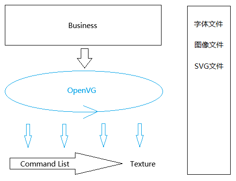
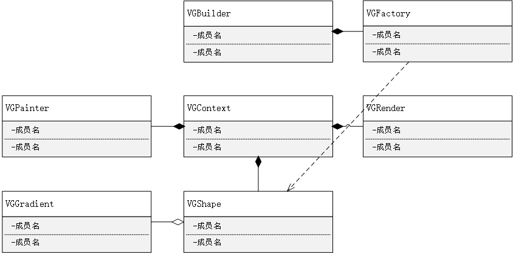

# 设计主旨

## To be more opened, more abstract, more tolerant, more powerful.

# 整体设计

  

# 详细设计

  

### 需求列表
- [ ] path.moveTo
- [ ] path.lineTo
- [ ] path.fill
- [ ] path.gradient
- [ ] path.stroke
- [ ] path.strokeFill
- [ ] path.strokeJoin
- [ ] path.strokeCap
- [ ] path.strokeDash
- [ ] path.translate
- [ ] path.scale
- [ ] path.rotate
- [ ] path.image
- [ ] path.text
- [ ] path.font
